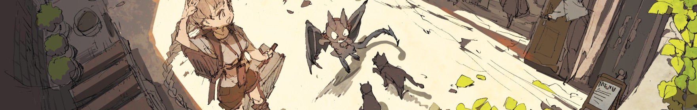

# ✨ @Renforce Dynamics: Enabling the Next Generation of Robotic Motion

  
  
  <h1>Renforce Dynamics</h1>
  

    🚀 Driving Precision Motion in Robotics through Reinforcement Learning (RL)

  
  

    
    
  

---

## 💡 Our Focus: RL-Powered Motion Intelligence

We bridge cutting-edge **AI algorithms** with **real-world robotic systems**, specializing in building adaptive, efficient, and robust motion solutions.

| Core Focus | Key Challenges We Solve | 
| :--- | :--- | 
| **🧠 Reinforcement Learning (RL)** | Efficiency and convergence of algorithms in dynamic environments |
| **⚙️ Motion Control (Control)** | Optimizing real-time responsiveness and multi-joint stability |
| **🗺️ Motion Planning (Planning)** | Path robustness in complex, unstructured scenarios |

 

## 🤝 Collaborate with Us / Join the Team! (Call to Action)

We are actively seeking **researchers, engineers, and teams** who are passionate about the intersection of robotics and RL.

### Open Roles
We are looking for talented individuals with expertise in:
* **[Intern] RL Research** (Focus on algorithm optimization for robotics)
* **[Intern] Robotics Engineer** (Focus on hardware-software integration and deployment)
* **[Full-Time] Motion Planner** (For experienced candidates)

  <a href="mailto:ziang_zheng@foxmail.com" style="text-decoration:none;">
    <button style="
      background-color: #FF6F00; 
      color: white; 
      padding: 12px 25px; 
      font-size: 18px; 
      font-weight: bold;
      border: none; 
      border-radius: 8px;
      box-shadow: 0 4px 6px rgba(0,0,0,0.2); 
      transition: background-color 0.3s ease; 
      cursor: pointer;" 
      onmouseover="this.style.backgroundColor='#E65100'" 
      onmouseout="this.style.backgroundColor='#FF6F00'">
      📩 Apply / Initiate Collaboration
    </button>
  </a>

### 🌐 Stay Connected
* **Website**：[renforce-dynamics.github.io](https://renforce-dynamics.github.io)
* **Email**：[ziang_zheng@foxmail.com](ziang_zheng@foxmail.com)
* **Updates**：Follow this organization for team news and project releases.

---

  
💡 Let's shape the future of high-precision robotic motion together!

