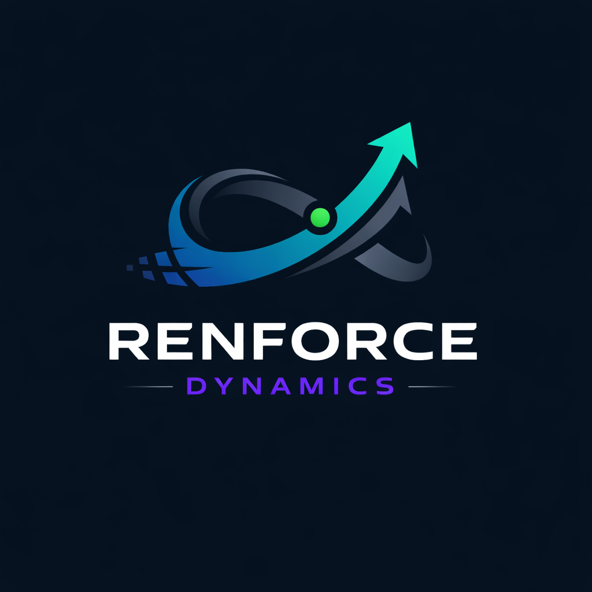

# 👋 Welcome to @Renforce Dynamics

  

  

  
    Precision Robotics × Deep Reinforcement Learning ·
    Team Lead: <b>@ZiangZheng</b> · THU
  

---

> **We build adaptive, deployable motion intelligence for real-world robots.**  
> Reinforcement Learning × Control × Hardware, with a focus on  
> **manipulation**, **whole-body behaviors**, and **Sim2Real deployment**.

---

## Research Focus

- **Deep Reinforcement Learning**  
  Policy optimization · World models · Offline & constrained RL  

- **Motion Control & Planning**  
  Robust controllers · Whole-body control · Real-time optimization  

- **Sim2Real Systems**  
  Simulation pipelines · Calibration · On-robot deployment  

---

## Open Positions

> **RL Intern** · **Robotics Engineer Intern** · **Motion Planning Engineer**

We are continuously looking for motivated students and engineers interested in
learning-based control and real-world robotic systems.

📬 **Contact**: [ziang_zheng@foxmail.com](mailto:ziang_zheng@foxmail.com)  
🌐 **Website**: https://renforce-dynamics.github.io  
💬 **Discussion**: https://github.com/Renforce-Dynamics/.github/blob/main/discussions.md  

---

## Community

| Renforce Dynamics | **Join our WeChat Group** |
|:--|:--|
|  |  |

