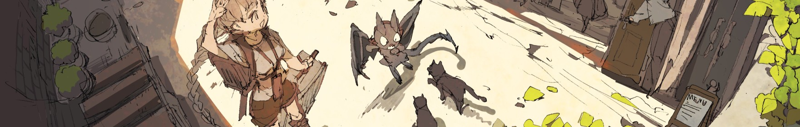

# 👋 Welcome to @Renforce Dynamics

  

  

  
    Precision Robotics × Deep Reinforcement Learning ·
    Team Lead: <b>@ZiangZheng</b> · THU
  

> **We build adaptive, deployable motion intelligence for real-world robots.**  
> Reinforcement Learning × Control × Hardware, with a focus on  
> **manipulation**, **whole-body behaviors**, and **Sim2Real deployment**.
> Details in 🌐 [**Website**](https://renforce-dynamics.github.io)
💬 [**Discussion**](https://github.com/Renforce-Dynamics/.github/blob/main/discussions.md)  

## Contact us & Community

📬 **Mail**: [ziang_zheng@foxmail.com](mailto:ziang_zheng@foxmail.com) 
💬 **Wechat**: interval_package

| **RedNote** | **WeChat Group 1** | **WeChat Group 2** |
|:--|:--|
|  |  |  |

## One More Thing

<b>🚀 Open Positions — Join Us</b>

 

**Roles**
- RL Intern  
- Robotics Engineer Intern  
- Motion Planning Engineer  

We are continuously looking for motivated students and engineers passionate about learning-based control and real-world robotic systems.

Feel free to contact~ 📬 **Mail**: [ziang_zheng@foxmail.com](mailto:ziang_zheng@foxmail.com)

<b>🌟 Awesome Repositories We Build</b>

 

| Repository | Description | Stars |
|:--|:--|:--:|
| [**beyondAMP**](https://github.com/Renforce-Dynamics/beyondAMP) | Advanced motion priors and AMP-style policy learning framework |  |
| [**trackerLab**](https://github.com/Renforce-Dynamics/trackerLab) | High-performance motion tracking and control utilities |  |
| [**MultiModalWBC**](https://github.com/Renforce-Dynamics/MultiModalWBC) | Multi-modal whole-body control framework |  |
| [**IsaacNPC**](https://github.com/Renforce-Dynamics/IsaacNPC) | Character and behavior control in Isaac-based simulation |  |
| [**soccerWeber**](https://github.com/Renforce-Dynamics/soccerWeber) | Humanoid soccer behavior learning framework |  |
| [**soccerLab**](https://github.com/Renforce-Dynamics/soccerLab) | Experimental research platform for robot soccer |  |
| [**assetslib**](https://github.com/Renforce-Dynamics/assetslib) | Shared robotics assets and configuration library |  |
| [**robotlib**](https://github.com/Renforce-Dynamics/robotlib) | Core robotics utilities and reusable system components |  |

